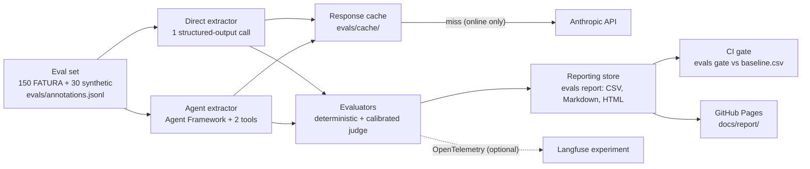

# invoice-extraction-evals

A reproducible evaluation harness for LLM invoice extraction in .NET 10. It defines six configurations (Claude Haiku
4.5 and Sonnet 5.5, plain and few-shot prompts, clean text and OCR input, one structured-output call and a Microsoft
Agent Framework agent with tools) over 180 invoices: 150 from the FATURA dataset and 30 generated edge cases. It
scores them with deterministic field metrics, an LLM judge for vendor names that is accepted only after calibration
against hand labels, and paired bootstrap confidence intervals. Every model call goes through a response cache that
is meant to be committed, so a finished benchmark can be replayed offline without an API key, and a CI gate fails a
pull request that makes a metric worse.

**Status (v0.9.0).** The harness is implemented and tested end to end up to the model call. No model has been run
yet, so this repository contains **no results**. [Producing results](#producing-results) lists the exact commands and
what they cost.



## What is measured and why

Invoice extraction fails in a few specific ways: a hallucinated field, a missed field, a "corrected" total, a vendor
name that is almost right. Each metric targets one of them.

| Metric | Type | Why it is there |
|---|---|---|
| Schema validity: the response parses into `InvoiceDto` | deterministic | An answer a program cannot read is worth nothing |
| Field accuracy: 10 fields, exact after normalization, with false-positive and miss rates | deterministic | Separates "invents values" from "misses values" |
| Line-items F1 on the synthetic set (FATURA has no line-item labels) | deterministic | Tables are where extraction usually breaks |
| `recomputed_total_rate`: the model "fixed" a total that is printed wrong | deterministic | Ground truth is what is printed |
| Vendor / customer name, judged variant for the gray zone | LLM judge, calibrated | "Acme Intl." vs "Acme International" is a match that string rules miss |
| Composite: weighted mean of the above, strict names only | deterministic | One number for the gate and the comparisons |
| Agent: tool calls, `validate_totals` called, `tool_override_rate`, warning precision | deterministic | Does the agent use its tools, and does it obey them? |
| Agent: tool-call accuracy, task adherence (`Microsoft.Extensions.AI.Evaluation.Quality`) | LLM, secondary | Reported only; never in the composite or the gate |
| Cost ($/1k documents) and latency (p50/p95, original network latency even on replay) | measured | Accuracy is only half of the choice |

Exact definitions, outcome categories and composite weights: [docs/metrics.md](docs/metrics.md). Why the harness is
built this way: [docs/design-decisions.md](docs/design-decisions.md).

## Dataset

**FATURA.** 150 invoice images from [FATURA](https://zenodo.org/records/10371464) (M. Limam, M. Dhiaf, Y. Kessentini,
[arXiv:2311.11856](https://arxiv.org/abs/2311.11856), [CC BY 4.0](https://creativecommons.org/licenses/by/4.0/),
redistributed unmodified; attribution in [evals/golden/README.md](evals/golden/README.md)). Five of FATURA's 50
layouts are held out as a 20-document dev pool for prompt writing; the golden set is stratified over the other 45
layouts (3 or 4 documents each), sampled by SHA-256 rank with seed 42. `evals download` rebuilds it byte for byte.

**Synthetic.** 30 generated invoices (`evals synthesize`) in seven families: credit notes, discounts, multi-currency,
multi-page, many tax lines, legal-suffix vendor names, due date before invoice date. They are the only documents with
line-item labels.

**Read these before any score** (details in
[annotation-guidelines.md](docs/annotation-guidelines.md#known-limitations-of-fatura-as-ground-truth)):

- Ground truth is **what is printed**, not what is arithmetically correct. FATURA amounts reconcile in 8 of the 5,597
  documents that print a subtotal and a total, and the due date precedes the invoice date in about half of those
  that print both dates.
- `null` means **not printed**; a value there is a false positive. `lineItems: null` means not annotated.
- FATURA has no line-item labels, only 34 distinct vendor names, US addresses only, three currency forms, English only.
- The "text" input is the text of FATURA's labelled spans, without the item table. That is cleaner than a real
  invoice. The "ocr" input never contains the vendor name, so vendor scores in OCR mode measure the dataset.
- Synthetic-only metrics rest on 30 documents and are flagged n < 30.

## Configurations

Defined in [`evals/configs.json`](evals/configs.json). Each one differs from a reference configuration in one
dimension, so a paired comparison isolates that dimension.

| Config | Model id | Prompt | Input | Extractor | Isolates (vs) |
|---|---|---|---|---|---|
| `mini-plain` | `claude-haiku-4-5`, temperature 0 | `plain` | text | direct | reference |
| `mini-fewshot` | `claude-haiku-4-5`, temperature 0 | `fewshot` | text | direct | two worked examples from the dev pool (vs `mini-plain`) |
| `mini-plain-ocr` | `claude-haiku-4-5`, temperature 0 | `plain` | ocr | direct | noisy OCR input (vs `mini-plain`) |
| `strong-plain` | `claude-sonnet-5-5`, thinking `between_tools` | `plain` | text | direct | a stronger model (vs `mini-plain`) |
| `agent-mini` | `claude-haiku-4-5`, temperature 0 | `agent` | text | agent | agent loop and tools (vs `mini-plain`) |
| `agent-strong` | `claude-sonnet-5-5`, thinking `between_tools` | `agent` | text | agent | agent loop and tools (vs `strong-plain`) |

The direct extractor makes one structured-output call against the `InvoiceDto` JSON schema. The agent is an Agent
Framework `ChatClientAgent` with at most 6 tool-call rounds and two deterministic tools: `validate_totals` reports
whether the printed amounts reconcile, `normalize_currency` maps a symbol or name to an ISO code. Both only report;
the `agent` prompt is `plain` plus the rule *"extract totals as printed; report an inconsistency in `warnings`, never
change a value"*. The Sonnet configs leave temperature unset (`null`) and send the lowest thinking setting, so the
model comparison also changes the sampling setting.

## Vendor-name judge and its calibration

The strict name metrics compare normalized strings. The judged variant differs only in the **gray zone**: strict
comparison failed and both names are present. There, [`NameJudge`](src/InvoiceEvals.Evaluation/NameJudge.cs)
(`claude-haiku-4-5`, temperature 0, one structured-output call returning `{reason, equivalent}`) sees the field, both
names and up to 7 lines of the document's text around the annotated name. Its prompt is
[`evals/judge/judge_prompt.md`](evals/judge/judge_prompt.md), versioned in its header. The composite uses the strict
metric, so it does not depend on the judge.

Calibration procedure:

1. `evals judge pairs` writes `evals/judge/calibration_pairs.jsonl`: every distinct real gray-zone mismatch from the
   latest run of each config, topped up to 60 pairs with seeded perturbations of golden names (legal suffix,
   abbreviation, OCR-style character errors, reordered words, a different company containing the name, a different
   party).
2. A person fills in `human_label` for every pair, without looking at judge output. Regenerating keeps labels by id.
3. `evals judge calibrate` runs the judge on the labelled pairs and writes `calibration_report_v<version>.md`: Cohen's
   κ, the confusion matrix, agreement per origin and every disagreement with the judge's reason.
4. **Acceptance rule: κ ≥ 0.75.** Below that, the prompt may be revised on this set **once**; the revision bumps the
   version and gets its own report, and the earlier report is kept. If the revision is also below 0.75, judged-name
   columns are reported as unvalidated.

## Statistics: is a difference real?

`evals compare --a <reference> --b <candidate>` pairs the two configurations' latest executions by document id and
bootstraps the per-document deltas (candidate − reference): 10,000 resamples with replacement, seed 42, SplitMix64,
95% percentile interval. A difference is **significant** when the interval excludes 0. It is computed for the
composite, schema validity, every field, both judged names and line-items F1, split into FATURA and synthetic rows
when their mean deltas have opposite signs. Rows with n < 30 are flagged as too coarse to conclude from. Pairing
removes document difficulty from the variance; the interval covers sampling of documents, not run-to-run model
variance, because a cached run is a single draw.

## Langfuse experiments

Optional. With `LANGFUSE_PUBLIC_KEY`, `LANGFUSE_SECRET_KEY` and `LANGFUSE_BASE_URL` set, each `evals run` (an offline
replay included) is exported over OpenTelemetry as one Langfuse experiment. `evals langfuse sync-dataset` creates the
dataset once and writes `evals/langfuse-items.json` so traces link to dataset items.

| Harness concept | Langfuse |
|---|---|
| Eval set (180 documents) | dataset `invoice-extraction-evals`, one item per document (deterministic item ids) |
| One `evals run` (execution name `<UTC time>-<git sha>`) | one experiment; config, model, prompt version, input mode, judge prompt version and git sha as experiment metadata |
| One document | one trace, linked to its dataset item, with the golden DTO as expected output |
| A model call | a GenAI child span with token usage and original latency; agents add `invoke_agent` and `execute_tool` spans |
| Every per-document metric | a score on the trace's root observation |

Traces go to the `experiment` environment.

## How the CI gate works

Two workflows run on pull requests. [`ci`](.github/workflows/ci.yml) builds with warnings as errors and runs the unit
tests; it needs nothing but the SDK. [`eval-gate`](.github/workflows/eval-gate.yml) also builds and tests, then for each
configuration:

1. If `evals/cache/` has no entries for the config, it logs `Skipping <config>: evals/cache has no entries for it` and
   moves on.
2. Otherwise it replays the config with `evals run --offline`, no key and no network. A changed prompt, model, judge
   prompt or tool definition misses the cache, and the job fails with the command to run locally.
3. `evals report` aggregates, and `evals gate` compares the result with `evals/results/baseline.csv`. A cell fails
   when it dropped by more than its threshold, became n/a, or its config was not run. The table is posted as one
   sticky PR comment.

**The gate activates once a baseline is committed.** Until then the workflow passes with a "gate inactive" notice:
today there is no cache and no baseline, so it only builds and tests. The baseline moves only through
`evals gate --update-baseline`, in a PR that explains why.

Thresholds ([`evals/thresholds.json`](evals/thresholds.json)), largest allowed absolute drop per config:

| Metric | Subset | Max drop |
|---|---|---|
| `schema_validity` | combined | 0.01 |
| `composite` | combined | 0.01 |
| `invoice_number_accuracy` | combined | 0.02 |
| `total_accuracy` | combined | 0.02 |
| `vendor_name_judged_accuracy` | combined | 0.03 |
| `line_items_f1` | synthetic | 0.03 |
| `validate_totals_called_rate` (agent configs) | combined | 0.02 |

Cached replays are deterministic, so any drop is a real change; on the 180-document set, one document is 0.0056 of a
0/1 metric.

## Producing results

Everything below calls the Anthropic API and needs `EVALS_API_KEY`. Nothing here has been run yet.

**1. Estimate.** `evals run --config <name> --dry-run` prints documents, tokens and cost without calling the API.
For the full 180-document set, at the list prices in [`evals/pricing.json`](evals/pricing.json) (hand-maintained,
checked 2026-10-08):

| Config | Extraction (estimate) | Per 1k documents | Name judge (upper bound) | Agent quality judges |
|---|---|---|---|---|
| `mini-plain` | $0.43 | $2.37 | $0.88 | n/a |
| `mini-fewshot` | $0.55 | $3.03 | $0.88 | n/a |
| `mini-plain-ocr` | $0.43 | $2.41 | $0.88 | n/a |
| `strong-plain` | $0.85 | $4.74 | $0.88 | n/a |
| `agent-mini` | $1.91 (upper bound $5.00) | $10.63 | $0.88 | $2.06 |
| `agent-strong` | $3.83 (upper bound $10.00) | $21.25 | $0.88 | $2.06 |

These are heuristics (3.5 characters per token, +20% margin; agents assume 3 turns per document). The judge column
assumes every name is in the gray zone, so real judge cost is a fraction of it. Calibration (`evals judge calibrate
--dry-run`) adds up to 60 judge calls.

**2. Run, calibrate, compare, gate.**

```sh
export EVALS_API_KEY=...                       # an Anthropic key
for c in mini-plain mini-fewshot mini-plain-ocr strong-plain agent-mini agent-strong; do
  evals run --config $c                        # responses → evals/cache/, scores → evals/results/store/
done
evals judge pairs                              # → evals/judge/calibration_pairs.jsonl; label human_label by hand
evals judge calibrate                          # → evals/judge/calibration_report_v1.0.md (κ ≥ 0.75 to accept)
evals report                                   # → evals/results/summary.csv, summary.md, <execution>.csv,
                                               #   docs/results-by-layout.md, docs/report/index.html
evals compare --a mini-plain --b mini-fewshot mini-plain-ocr strong-plain agent-mini \
  --markdown evals/results/comparisons.md
evals compare --a strong-plain --b agent-strong --markdown evals/results/comparisons-strong.md
evals gate --update-baseline                   # → evals/results/baseline.csv
```

**3. Commit** `evals/cache/`, `evals/judge/`, `evals/results/` (the raw `store/` is gitignored and rebuilt by an
offline replay) and `docs/`, in one PR that explains the baseline. From then on, the CI gate is active. The results
table, the comparisons and the agent-vs-direct verdict ([docs/agent-vs-direct.md](docs/agent-vs-direct.md)) are
written from these files, and from nothing else.

The HTML report is published to GitHub Pages by [`pages.yml`](.github/workflows/pages.yml) when `docs/report/` changes
on `main`. Pages must first be enabled (Settings → Pages → Source: GitHub Actions); there is no published report yet.

## Quickstart

Requires the [.NET 10 SDK](https://dotnet.microsoft.com/download). No API key is needed for anything in this section.

```sh
git clone https://github.com/NikitaFlimakov/invoice-extraction-evals && cd invoice-extraction-evals
dotnet tool restore && dotnet test
evals() { dotnet run --project src/InvoiceEvals.Cli -- "$@"; }
evals run --config mini-plain --limit 3 --dry-run   # loads data, prompt, judge and prices; no model call
evals --help                                        # download | synthesize | run | report | compare | judge | gate | langfuse
```

Once a cache is committed, `evals run --config <name> --offline` replays a config with zero network calls, and
`evals report` rebuilds every table from it.

## Layout

```
src/InvoiceEvals.Core         InvoiceDto schema, golden set I/O, FATURA converter, stratified sampler
src/InvoiceEvals.Extraction   direct IChatClient extractor, latency stamping, GenAI tracing, offline client
src/InvoiceEvals.Agent        Agent Framework extractor and its two tools
src/InvoiceEvals.Evaluation   evaluators, name judge, agent metrics, bootstrap and Cohen's κ
src/InvoiceEvals.Synthetic    QuestPDF generator for the synthetic edge cases
src/InvoiceEvals.Cli          evals download | synthesize | run | report | compare | judge | gate | langfuse
evals/                        golden set, dev pool, synthetic set, configs, prices, judge prompt, thresholds
prompts/                      plain, fewshot and agent prompts, versioned in their headers
docs/                         metrics, annotation guidelines, design decisions, agent-vs-direct protocol
```

Contributing (new configuration, new evaluator, refreshing the cache): [CONTRIBUTING.md](CONTRIBUTING.md).

## License

Code: [MIT](LICENSE). FATURA data: [CC BY 4.0](https://creativecommons.org/licenses/by/4.0/), by M. Limam, M. Dhiaf
and Y. Kessentini ([arXiv:2311.11856](https://arxiv.org/abs/2311.11856)), redistributed unmodified; attribution in
[evals/golden/README.md](evals/golden/README.md). Synthetic invoices are rendered with QuestPDF under its Community
license.
