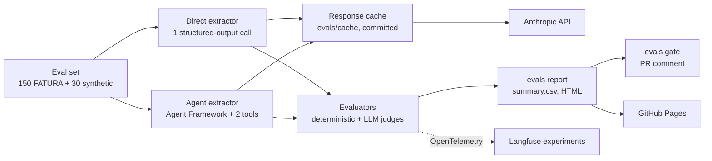

# invoice-extraction-evals

A reproducible benchmark for LLM invoice extraction in .NET 10. It scores six configurations (Claude Haiku 4.5 and
Sonnet 5.5, plain and few-shot prompts, text and OCR input, one structured-output call and a Microsoft Agent
Framework agent with tools) on 180 invoices. It uses deterministic field metrics, a calibrated LLM judge for vendor
names, and paired bootstrap confidence intervals. Every model call is in a committed response cache, so anyone can
replay the whole benchmark offline, with no API key, and CI fails a pull request that makes a number worse.



## Results

> **Pending.** No configuration has been run and cached yet. `evals report` fills this table from
> `evals/results/summary.md`; the live HTML report will be at
> **[nikitaflimakov.github.io/invoice-extraction-evals](https://nikitaflimakov.github.io/invoice-extraction-evals/)**.

| Configuration | Schema valid | Invoice no. | Total | Vendor (judged) | Line-items F1 (synthetic) | Composite | $/1k docs | p50 / p95 ms |
|---|---|---|---|---|---|---|---|---|
| `mini-plain` | pending | pending | pending | pending | pending | pending | pending | pending |
| `mini-fewshot` | pending | pending | pending | pending | pending | pending | pending | pending |
| `mini-plain-ocr` | pending | pending | pending | pending | pending | pending | pending | pending |
| `strong-plain` | pending | pending | pending | pending | pending | pending | pending | pending |
| `agent-mini` | pending | pending | pending | pending | pending | pending | pending | pending |
| `agent-strong` | pending | pending | pending | pending | pending | pending | pending | pending |

`mini` = `claude-haiku-4-5`, `strong` = `claude-sonnet-5-5` with thinking off (`between_tools`). In `mini-plain-ocr`
the FATURA OCR layer never contains the vendor name, so that column measures the dataset there.

### Is the difference real?

Paired bootstrap, 10,000 resamples, 95% CI on the mean per-document Δ composite; every metric is in
[`evals/results/comparisons.md`](evals/results/comparisons.md).

| Comparison (Δ composite) | n | Mean Δ | 95% CI | Significant |
|---|---|---|---|---|
| `mini-plain` → `mini-fewshot` | pending | pending | pending | pending |
| `mini-plain` → `strong-plain` | pending | pending | pending | pending |
| `mini-plain` → `mini-plain-ocr` | pending | pending | pending | pending |

### Does an agent help?

Pending: [docs/agent-vs-direct.md](docs/agent-vs-direct.md) compares `mini-plain` with `agent-mini` and `strong-plain`
with `agent-strong` on accuracy, `tool_override_rate` (does the agent "fix" printed totals its tool says don't add
up?), tokens, cost and latency, and gives a verdict.

### Is the judge trustworthy?

The vendor-name judge decides only the gray zone (strict mismatch, both names present). Cohen's κ against hand labels:
pending (target ≥ 0.75), in [`evals/judge/`](evals/judge/).

## What it measures

| Metric | Type |
|---|---|
| Schema validity: the response parses into `InvoiceDto` | deterministic |
| Field accuracy: 10 fields, exact after normalization, with false-positive and miss rates | deterministic |
| Line-items F1 on the synthetic edge cases (FATURA has no line-item labels) | deterministic |
| `recomputed_total_rate`: the model "fixed" a total that is printed wrong | deterministic |
| Vendor / customer name, judged variant for the gray zone | LLM judge, calibrated |
| Agent: tool calls, `validate_totals` / `normalize_currency` called, `tool_override_rate`, warning precision | deterministic |
| Agent: tool-call accuracy, task adherence (`Microsoft.Extensions.AI.Evaluation.Quality`) | LLM, secondary |
| Cost ($/1k documents) and latency (p50/p95, original network latency even on replay) | measured |

Definitions: [docs/metrics.md](docs/metrics.md). All docs: [docs/](docs/README.md).

## Quickstart

Requires the [.NET 10 SDK](https://dotnet.microsoft.com/download). No API key is needed to replay.

```sh
git clone https://github.com/NikitaFlimakov/invoice-extraction-evals && cd invoice-extraction-evals
dotnet tool restore && dotnet test
evals() { dotnet run --project src/InvoiceEvals.Cli -- "$@"; }
evals run --config mini-plain --offline    # replay from evals/cache/, zero network calls
evals report                               # evals/results/summary.csv + summary.md, docs/report/index.html
```

To run new calls, export `EVALS_API_KEY` (an Anthropic key) and always estimate first:

```sh
evals run --config agent-mini --dry-run    # documents, tokens, cost (extraction + judges)
evals run --config agent-mini              # responses cached in evals/cache/
evals compare --a mini-plain --b agent-mini
evals gate                                 # regression check against evals/results/baseline.csv
```

## How the gate works

Every pull request replays all six configurations from the committed cache with `evals run --offline`, so CI needs no
key and costs nothing. A changed prompt, model, judge prompt or tool definition misses the cache, and the run fails
with the command to run locally. `evals gate` then compares the fresh summary with
[`evals/results/baseline.csv`](evals/results/), fails the PR if a metric drops by more than its threshold, and posts
the before/after table as one sticky PR comment. The baseline moves only through `evals gate --update-baseline`, in a
PR that explains why.

| Metric | Subset | Max drop (absolute) |
|---|---|---|
| Schema validity | combined | 0.01 |
| Composite | combined | 0.01 |
| Invoice number accuracy | combined | 0.02 |
| Total accuracy | combined | 0.02 |
| Vendor name (judged) accuracy | combined | 0.03 |
| Line-items F1 | synthetic | 0.03 |
| `validate_totals` called (agent configs) | combined | 0.02 |

## Traces (Langfuse)

Optional. With `LANGFUSE_PUBLIC_KEY`, `LANGFUSE_SECRET_KEY` and `LANGFUSE_BASE_URL` set, every `evals run` (including
an offline replay) is a Langfuse experiment: one trace per document linked to its dataset item. Model calls are
GenAI spans with token usage and original latency. For agents, the `invoke_agent` span holds the chat and
`execute_tool` spans. Every metric is posted as a score. Run `evals langfuse sync-dataset` once to link dataset items.

> Screenshots pending: `docs/images/langfuse-experiment.png`, `docs/images/langfuse-agent-trace.png`.

## Data and caveats

150 invoices from [FATURA](https://zenodo.org/records/10371464), 3 from each of its 50 layouts, sampled with a fixed
seed, plus 30 generated edge cases (credit notes, discounts, multi-currency, multi-page, many tax lines, legal
suffixes, due date before invoice date). Read these before any score: FATURA's amounts do not reconcile (ground
truth is what is printed), its dates are random, it has no line-item labels, and it has only 34 distinct vendors.
Synthetic-only metrics rest on 30 documents and are flagged n < 30. See
[known limitations](docs/annotation-guidelines.md#known-limitations-of-fatura-as-ground-truth).

## Layout

```
src/InvoiceEvals.Core         InvoiceDto schema, golden set I/O, FATURA converter, stratified sampler
src/InvoiceEvals.Extraction   direct IChatClient extractor, latency stamping, GenAI tracing, offline client
src/InvoiceEvals.Agent        Agent Framework extractor and its two tools
src/InvoiceEvals.Evaluation   evaluators, name judge, agent metrics, bootstrap and Cohen's κ
src/InvoiceEvals.Synthetic    QuestPDF generator for the synthetic edge cases
src/InvoiceEvals.Cli          evals download | synthesize | run | report | compare | judge | gate | langfuse
evals/                        golden set, configs, judge prompt and calibration, response cache, thresholds, results
```

Contributing (new configuration, new evaluator, refreshing the cache): [CONTRIBUTING.md](CONTRIBUTING.md).

## License

Code: [MIT](LICENSE). FATURA data: [CC BY 4.0](https://creativecommons.org/licenses/by/4.0/), by M. Limam, M. Dhiaf
and Y. Kessentini ([arXiv:2311.11856](https://arxiv.org/abs/2311.11856)), redistributed unmodified; attribution in
[evals/golden/README.md](evals/golden/README.md).
